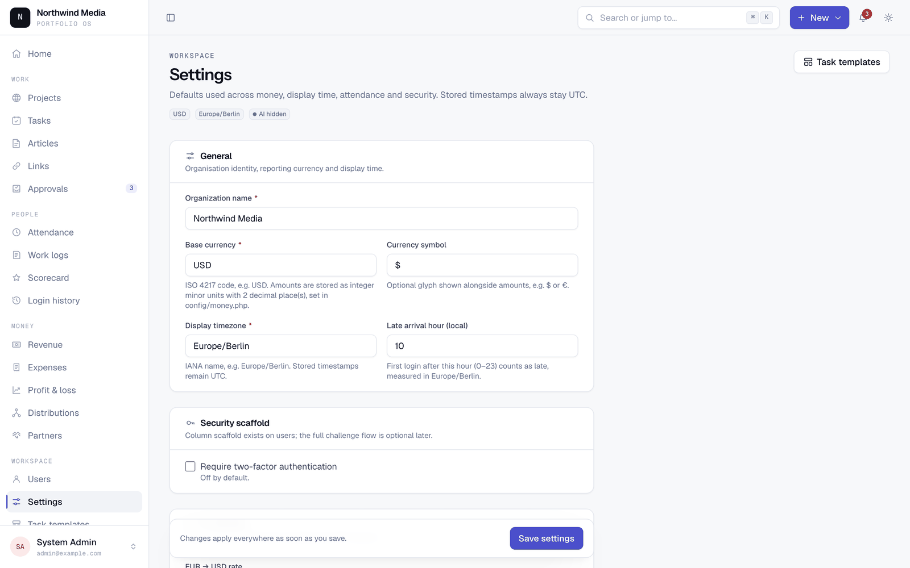
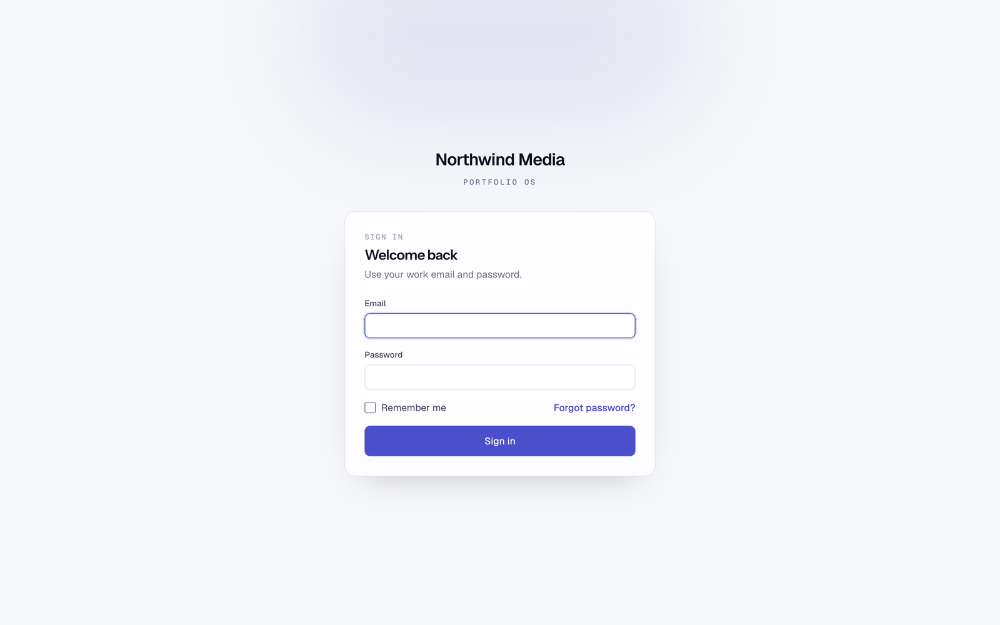

# Portfolio OS

An internal operations app for teams that run a portfolio of websites — projects and an encrypted credential vault, the day-to-day content work that keeps them alive, the people doing it, and the money coming in and out.

[](LICENSE)
[](composer.json)
[](composer.json)
[](composer.json)

## Why this exists

If you run more than a handful of content sites, the work spreads itself across a spreadsheet for revenue, a password manager you share badly, a task board nobody updates, and a monthly argument about who is owed what. Portfolio OS puts those in one place, with the parts that actually cause disputes — approvals, ownership percentages, profit splits — written down and audited instead of remembered.

It is also deliberately boring to host. The entire app runs on **PHP and MySQL on shared hosting**: no Node runtime on the server, no Redis, no queue daemon, no websockets, no container. Deployment is two zip files over FTP and a cron entry. That constraint shaped the architecture, and it is documented rather than apologised for — see [the design rationale](#why-shared-hosting-shaped-the-architecture).


## Screenshots

|  |  |
|---|---|
|  <br> **Portfolio** — every site, status, monetisation and open work at a glance. |  <br> **Project detail** — ownership split, team, and the encrypted credential vault. |
|  <br> **Tasks** — checklists, recurring work, bulk assignment, evidence on submit. |  <br> **Approval queue** — one keyboard-driven queue for tasks, article drafts and links. |
|  <br> **P&L** — per-project revenue, direct cost, allocated shared cost, net. |  <br> **Distributions** — manual profit splits by ownership, locked once approved. |
|  <br> **Revenue** — monthly entry or CSV import, with the FX rate frozen per row. |  <br> **Scorecards** — monthly output per person, priced against their pay rates. |
|  <br> **⌘K palette** — jump or create from anywhere. |  <br> **Dark mode** — a full second token set, no flash on load. |

<details>
<summary>More screens</summary>

| | |
|---|---|
|  |  |
|  |  |

The full navigation, not a cut-down version, on a phone:


</details>

## Features

### Projects & credentials
- Portfolio of sites with status, CMS, niche, monetisation state, acquisition cost and notes.
- **Encrypted credential vault** per project — hosting, CMS, registrar, analytics, ad network logins. Secrets are encrypted at rest with the app key; every reveal is written to an audit log with the user, time and IP.
- Credential **expiry alerts** on a schedule, with configurable warning windows.
- Per-project **ownership shares** that must total 100%, and a per-project team assignment that scopes what staff can see.

### Work
- Tasks with checklists, due dates, priorities, attachments, comments and an evidence field on submit.
- **Recurring tasks** generated from a template on a daily/weekly/monthly cadence.
- Reusable **task templates** (e.g. a default SEO checklist applied to every new site).
- Articles pipeline: brief → assigned → draft submitted → revision requested → published, with word-count targets and per-article cost.
- Link building log with per-project monthly budgets and spend tracking.
- One **approval queue** across tasks, articles and links, driven by keyboard (`j`/`k` to move, `a` approve, `r` reject). Approving an article or link can raise the matching expense automatically.

### People
- **Attendance without a clock**: the first successful login of the day is the check-in, marked late after a configurable hour. Supervisors can mark leave and holidays.
- Login history with IP and user agent.
- Short daily work logs.
- Monthly **scorecards** aggregating tasks, articles and links per person, costed against their pay rates.
- Mixed pay models per person — monthly salary and/or per-article, per-link, per-task rates.

### Money
- Revenue per project per month, entered directly or **imported from CSV**, in the base currency or a second source currency. Each row **freezes its own FX rate**, so a later rate change never rewrites history.
- Expenses: direct (charged to one project) or **shared** (allocated across projects on the P&L in proportion to revenue), with receipt uploads, recurring templates and paid/unpaid tracking.
- **Profit & loss** per month: revenue, direct cost, allocated shared cost, net profit, per project and portfolio-wide.
- **Partner distributions** — a draft run computes each owner's share from project ownership, and approving it locks the run permanently. Corrections are new adjusting entries, never edits.
- Partner ledger and per-partner statements covering capital contributions, withdrawals and distribution credits.
- All amounts are stored as **integer minor units**. No floats anywhere in the money path.

### Platform
- **Roles are many-to-many**: a person can be a partner *and* a supervisor, and their effective permissions are the union. 49 granular permissions across 5 seeded roles (admin, partner, supervisor, staff, accountant). No `role` column, no role switcher.
- Project-scoped queries filter by the user's assignments at the query level, not in the view.
- Audit log for money mutations and credential reveals.
- Design system: one set of tokens, a ~28-component Blade library, command palette, dark mode, compact density mode, keyboard shortcuts, full mobile layout. See [docs/DESIGN_AUDIT.md](docs/DESIGN_AUDIT.md).
- **Optional AI assistant** (see [below](#the-optional-ai-assistant)) — entirely hidden unless you configure a key.

## Tech stack

| | |
|---|---|
| Backend | PHP 8.3+, Laravel 13 |
| Frontend | Livewire 4, Alpine.js, Tailwind CSS 4, Blade |
| Database | MySQL 8 (production), SQLite (local & tests) |
| Build | Vite 8 (local only — no Node on the server), Node 20.19+/22+ |
| Tests | Pest 4 |
| Style | Laravel Pint |

No React, no Vue, no Inertia, no SPA build step on the server.

## Requirements

- **PHP 8.3+** with the usual Laravel extensions
- **Composer**
- **MySQL 8** for production, or SQLite for local work
- **Node.js 20.19+ or 22+** — only to build CSS/JS locally. The server never needs it.

## Quickstart

```bash
git clone https://github.com/YOUR_USERNAME/portfolio-os.git
cd portfolio-os

composer install
cp .env.example .env
php artisan key:generate

# SQLite is the default in .env.example
touch database/database.sqlite

# Creates the schema, roles, permissions and a demo portfolio
php artisan migrate --seed

npm install && npm run build

php artisan serve
```

Open <http://127.0.0.1:8000>.

To use MySQL instead, uncomment the `DB_*` block in `.env` and skip the `touch`.

### Demo credentials

`php artisan migrate --seed` creates five accounts, one per role, so you can see how the app changes shape per role:

| Role | Email | Password |
|---|---|---|
| Admin | `admin@example.com` | `password` |
| Partner | `partner@example.com` | `password` |
| Supervisor | `supervisor@example.com` | `password` |
| Staff | `staff@example.com` | `password` |
| Accountant | `accountant@example.com` | `password` |

> [!WARNING]
> The password `password` is only used when `APP_ENV` is `local` or `testing`. Anywhere else the seeder **generates a random password and prints it once** — copy it from the console output, it is not recoverable. Set `ADMIN_PASSWORD` in `.env` to choose your own instead.

The **demo data** — fake projects, credentials, work, people and money — is part of the same command, but only when `APP_ENV` is `local` or `testing`. Anywhere else it is skipped and `migrate --seed` gives you roles, permissions, settings, task templates and one admin account, which is what a real installation wants. `SEED_DEMO_DATA` overrides the decision in either direction.

The demo data uses `alpha-demo.test` / `beta-demo.test` domains and `example.com` addresses throughout.

### Configure it for your organisation

Nothing is hardcoded to one country or currency. The important knobs:

| Setting | Where | Notes |
|---|---|---|
| Organisation name | Settings screen | Shown in the sidebar and page titles. |
| Base currency, symbol | Settings screen, or `MONEY_BASE_*` in `.env` | The saved setting wins over the env default. |
| Minor-unit exponent | `MONEY_BASE_EXPONENT` | `2` for cents, `0` for JPY/KRW, `3` for KWD/BHD. **Choose before entering data.** |
| Second input currency | `MONEY_SOURCE_*` | For revenue paid in another currency. Set it equal to the base currency to run single-currency. |
| Display timezone | Settings screen, or `APP_DISPLAY_TIMEZONE` | Timestamps are always *stored* in UTC; this is display only, and it defines "today" for attendance. |
| Late arrival hour, credential alert windows | Settings screen | |

## Running tests

```bash
php artisan test          # full suite, SQLite in-memory
php artisan test --filter=Money
vendor/bin/pint           # format
vendor/bin/pint --test    # check without writing
```

Money calculations and approval flows require tests — see [CONTRIBUTING.md](CONTRIBUTING.md).

## Deployment

Full walkthrough: **[DEPLOYMENT.md](DEPLOYMENT.md)**. The short version:

```bash
./deploy/package.sh    # → deploy/dist/app.zip + public.zip
```

Upload `app.zip` to `laravel_app/` (outside the web root) and `public.zip` to `public_html/`, write a production `.env`, then run migrations through the token-gated `/_ops/migrate` route because there is no SSH. Two cron entries handle the scheduler and a `queue:work --stop-when-empty` drip.

`public/index.php` is dual-path: it finds `../laravel_app` on shared hosting and falls back to `..` locally, so the same file works in both places.

### Why shared hosting shaped the architecture

Every one of these is a deliberate constraint, not a missing feature:

- **Sessions, cache and queues all run on the database or filesystem.** Redis is never assumed.
- **Every queued job is safe to run late, out of order, or twice** — a cron drip is not a daemon, and it will do all three.
- **No `exec()`, `proc_open()`, or `symlink()` reliance.** `storage:link` falls back to copying, and there is a `/media/public/{path}` route for when even that fails. The database backup command is a pure-PHP SQL export, no `mysqldump`.
- **Assets are built locally and uploaded.** `npm` is never invoked on the server.
- **Fonts are self-hosted** WOFF2 subsets, so there is no CDN dependency at runtime.
- No Octane, Horizon, Reverb, Pulse or Telescope in production.

If you deploy to a normal VPS none of this hurts you — you just have headroom you are not using.

## Security

- **Credential vault**: secrets are encrypted at rest using Laravel's encrypter with `APP_KEY`. Because the key *is* the lock, rotating `APP_KEY` makes existing vault rows unreadable — back them up before you rotate.
- **Audit logging** covers money mutations and every credential reveal (who, when, from where).
- **The `/_ops/{action}` route is high-risk by design.** It runs migrations and cache commands over plain HTTP for hosts with no SSH. It is disabled entirely (404) when `OPS_TOKEN` is empty, rate-limited per IP, and should be re-disabled the moment a deploy finishes.
- **The AI assistant never sees secrets.** Credential rows, passwords, API keys and bank details are stripped before any prompt is built, and it is excluded at the code level rather than by convention.
- Financial records are never hard-deleted, and approved distribution runs are immutable.

Please report vulnerabilities privately — see [SECURITY.md](SECURITY.md).

## The optional AI assistant

Leave `AI_API_KEY` empty and the AI features do not exist: no nav entry, no routes that resolve, no code path that calls out. The app is complete without it.

With a key configured you get a natural-language "ask your data" box and drafted monthly summaries. Two rules are enforced in code:

1. **An LLM never generates SQL that gets executed.** Questions are mapped onto a fixed whitelist of read-only report methods, each of which applies the caller's own permissions and project scope.
2. **Credentials never leave the building.** The prompt payload is sanitised before it is built.

There is also a monthly spend cap (`AI_MONTHLY_BUDGET_CENTS`) with per-request token logging, and a response cache.

## Status & roadmap

All seven planned milestones are complete and the app is in production use. See [CHANGELOG.md](CHANGELOG.md).

Known gaps, honestly:

- **Changing `MONEY_BASE_EXPONENT` after you have entered data reinterprets every stored amount.** Stored integers carry no scale. There is no migration for this; pick the exponent up front.
- **Database column names keep their original `_paisa` / `_pkr_paisa` suffixes.** They mean "minor units of the base currency" regardless of which currency you configure. Renaming them would break existing installations for no functional gain, so the names stayed and the meaning is documented.
- **Multi-currency is one base plus one optional input currency**, not arbitrary per-project currencies.
- No inline editing (everything happens in modals and side forms), and reports are table-first with no charting library.
- Wide financial tables scroll horizontally on phones rather than reflowing into cards.

## Documentation

- [DEPLOYMENT.md](DEPLOYMENT.md) — shared-hosting deploy, ops route, cron, backups
- [docs/USER_GUIDE.md](docs/USER_GUIDE.md) — what each role can do, and the three-click path to common tasks
- [docs/DESIGN_AUDIT.md](docs/DESIGN_AUDIT.md) — the design system and its accepted gaps
- [CONTRIBUTING.md](CONTRIBUTING.md) — setup, architectural constraints, PR process
- [SECURITY.md](SECURITY.md) — reporting vulnerabilities, threat notes

## Contributing

Contributions are welcome. Please read [CONTRIBUTING.md](CONTRIBUTING.md) first — it covers the architectural constraints that are not negotiable (shared hosting, integer money, many-to-many roles, immutable approved distributions) and the tests expected for money and approval changes.

By participating you agree to the [Code of Conduct](CODE_OF_CONDUCT.md).

## Licence

MIT — see [LICENSE](LICENSE).

The bundled fonts (Geist, Geist Mono, Instrument Sans) are third-party software under the SIL Open Font License 1.1 and are not covered by the MIT licence; see [resources/fonts/LICENSE](resources/fonts/LICENSE).
