# Portfolio OS

**Run a portfolio of websites without a spreadsheet, a shared password file, and a monthly argument about who is owed what.**

Projects, an encrypted credential vault, the content work that keeps sites alive, the people doing it, and the money in and out — one app, on PHP and MySQL shared hosting.

[](https://github.com/tnandla/portfolio-os/actions/workflows/ci.yml)
[](LICENSE)
[](composer.json)
[](composer.json)
[](composer.json)

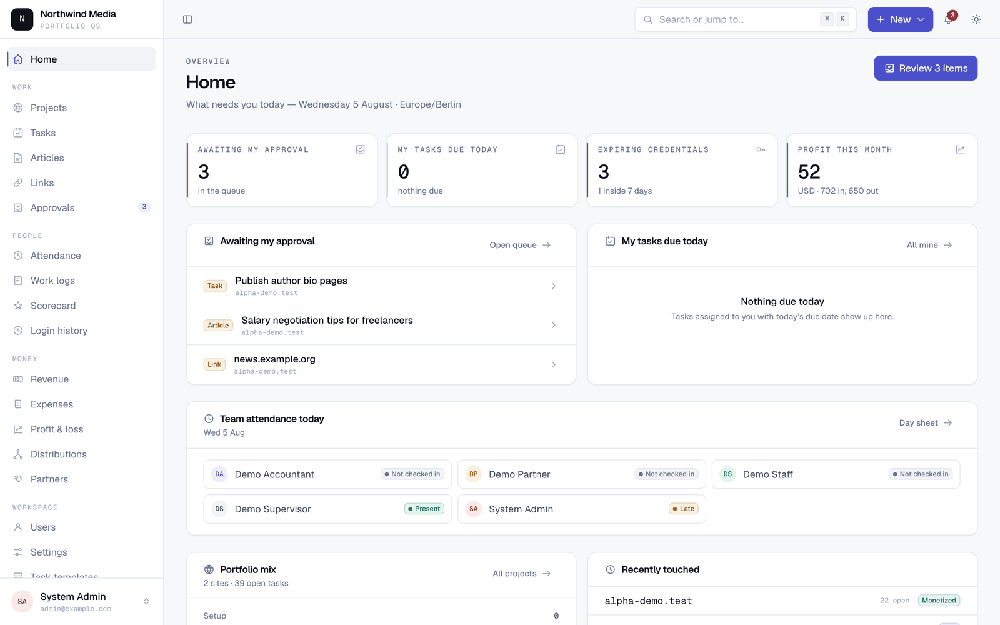

## Try it in two minutes

```bash
git clone https://github.com/tnandla/portfolio-os.git && cd portfolio-os
composer install && cp .env.example .env && php artisan key:generate
touch database/database.sqlite && php artisan migrate --seed
npm install && npm run build
php artisan serve
```

Open <http://127.0.0.1:8000> and sign in as `admin@example.com` / `password`. The seed also creates `partner@`, `supervisor@`, `staff@` and `accountant@example.com` with the same password — worth trying, because the app changes shape a lot depending on who is signed in.

**Full setup, MySQL, configuration and troubleshooting: [docs/INSTALL.md](docs/INSTALL.md).**

## What it does

### Stops credentials living in a shared file
An encrypted vault per project — hosting, CMS, registrar, analytics, ad network. Secrets are encrypted with your app key and only decrypted when someone with permission asks. Every reveal is logged with who, when and from where. Expiring credentials warn you before the domain lapses.

### Makes the money arguments unnecessary
Ownership percentages per project, enforced to total exactly 100%. Revenue per month with each row freezing its own FX rate, so a rate change next year never rewrites last year. Shared costs allocated across projects in proportion to revenue. Every amount is stored as a whole number of minor units, so rounding never quietly loses a partner's share. Approving a distribution locks it permanently — corrections are new entries, never edits.

### Turns "did anyone do it?" into a queue
Tasks with checklists and recurring templates, an article pipeline from brief to published, and a link-building log with per-project budgets. All three land in one keyboard-driven approval queue (`j`/`k` to move, `a` approve, `r` reject). Approving an article or link can raise the matching expense for you.

### Tracks people without a punch clock
The first login of the day is the check-in, marked late after an hour you choose. Monthly scorecards total each person's tasks, articles and links, costed against their own pay rates — mixed salary and per-item rates are normal, not an edge case.

### Fits how partnerships actually work
Roles are many-to-many, so one person can be a partner *and* a supervisor and gets the union of both. 49 permissions across five seeded roles. Project scoping is applied in the query, not hidden in the view, so a staff account cannot reach another project's data by changing an ID.

**Optional:** with an AI key configured you also get an "ask your data" box and drafted monthly summaries, behind a spend cap. Leave `AI_API_KEY` empty and the feature does not exist — no nav entry, no route, no outbound call. The app is complete without it.

<details>
<summary><strong>Screenshots</strong> — portfolio, project detail, tasks, approvals, P&L, distributions, revenue, scorecards, palette, dark mode, mobile</summary>

|  |  |
|---|---|
| 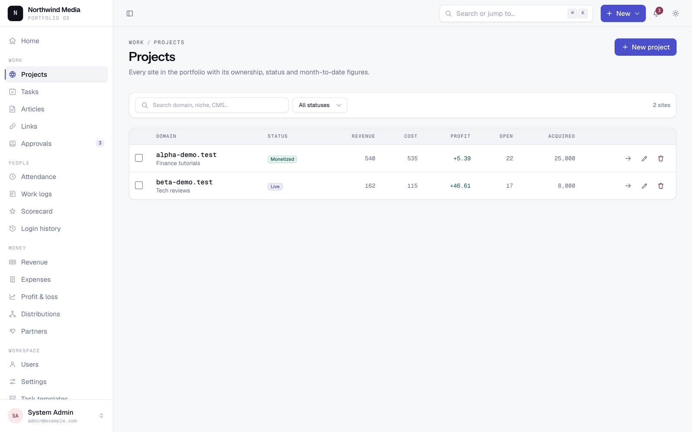 <br> **Portfolio** — every site, status, monetisation and open work. | 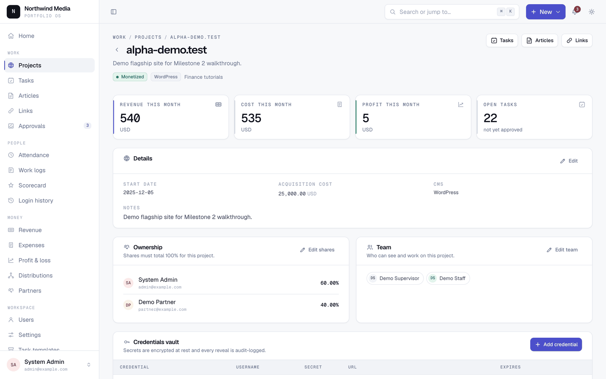 <br> **Project detail** — ownership split, team, credential vault. |
| 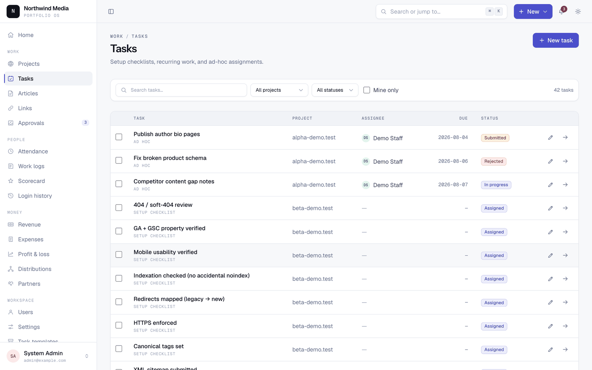 <br> **Tasks** — checklists, recurring work, bulk assignment. | 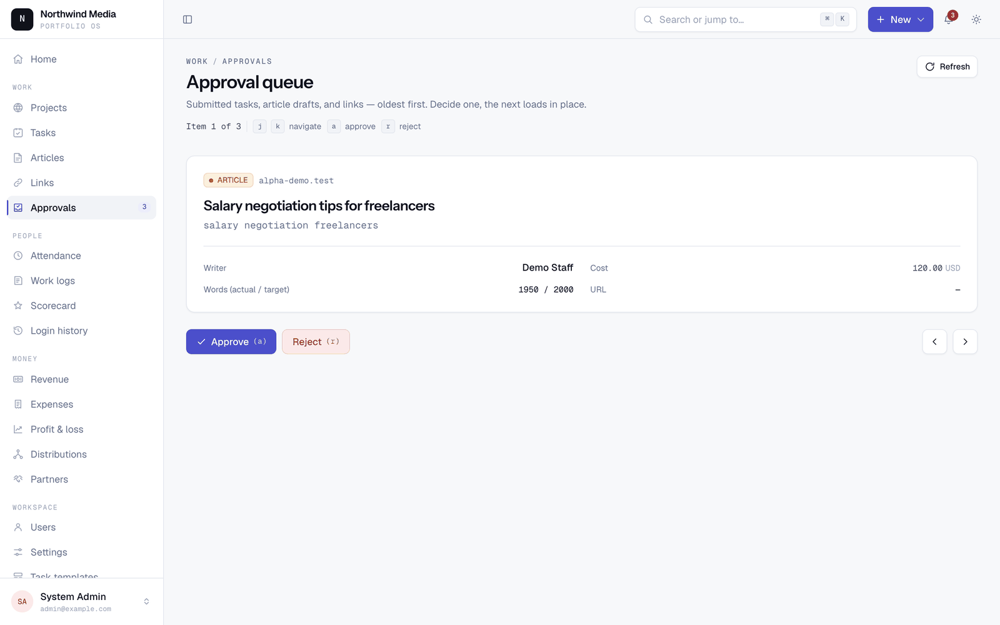 <br> **Approvals** — one queue for tasks, drafts and links. |
| 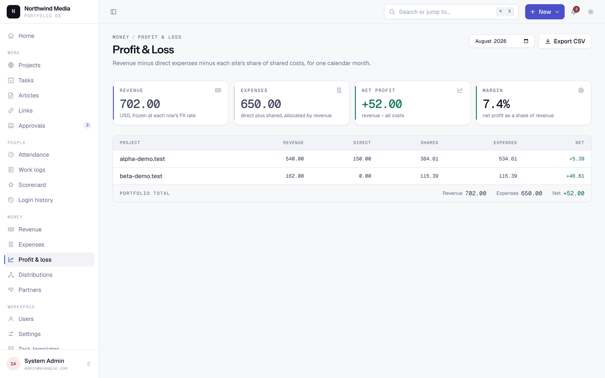 <br> **P&L** — revenue, direct cost, allocated shared cost, net. | 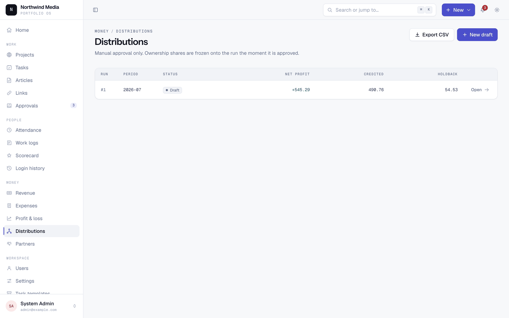 <br> **Distributions** — profit splits by ownership, locked on approval. |
| 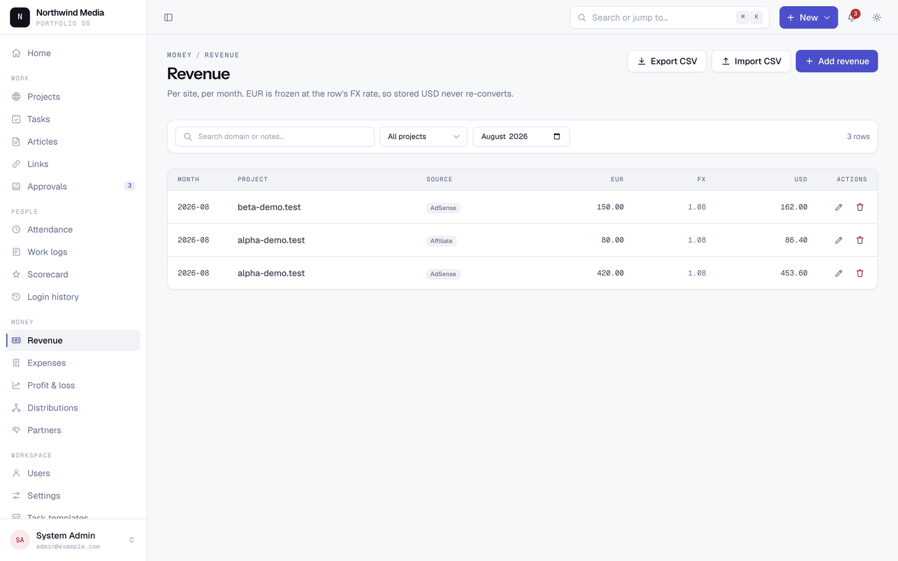 <br> **Revenue** — monthly entry or CSV import, FX frozen per row. | 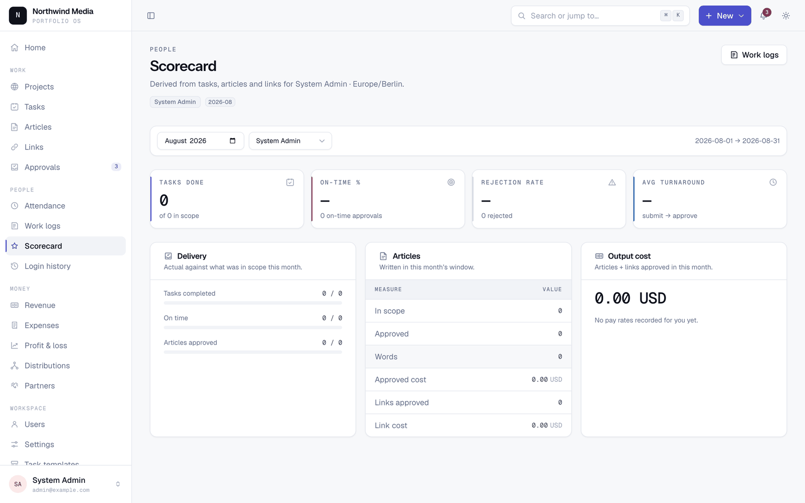 <br> **Scorecards** — monthly output per person, priced. |
| 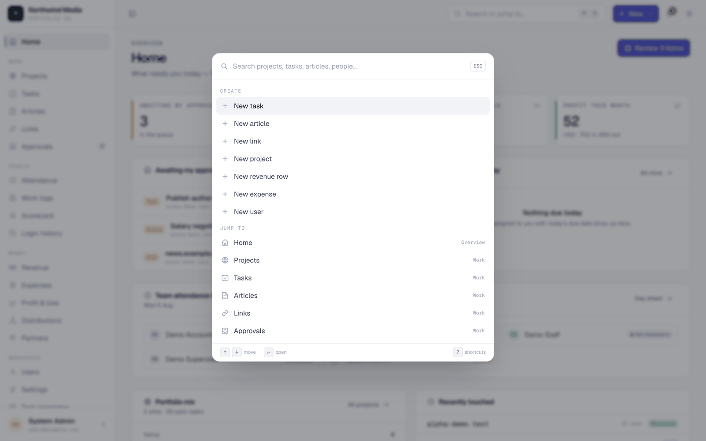 <br> **⌘K** — jump or create from anywhere. | 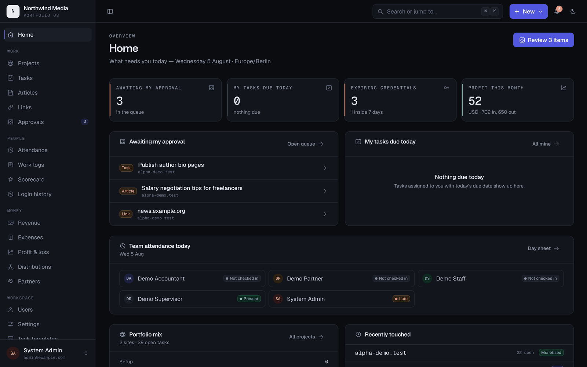 <br> **Dark mode** — a full second token set, no flash. |
| 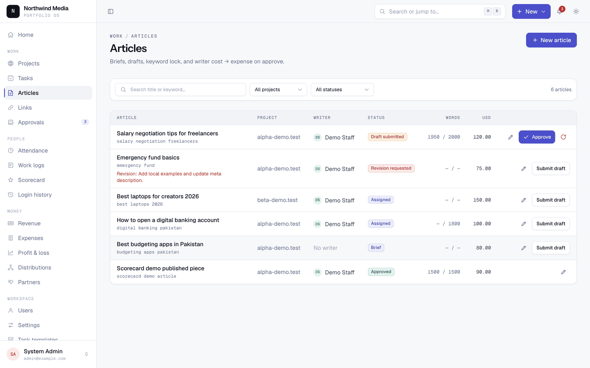 <br> **Articles** — brief to published, with cost. | 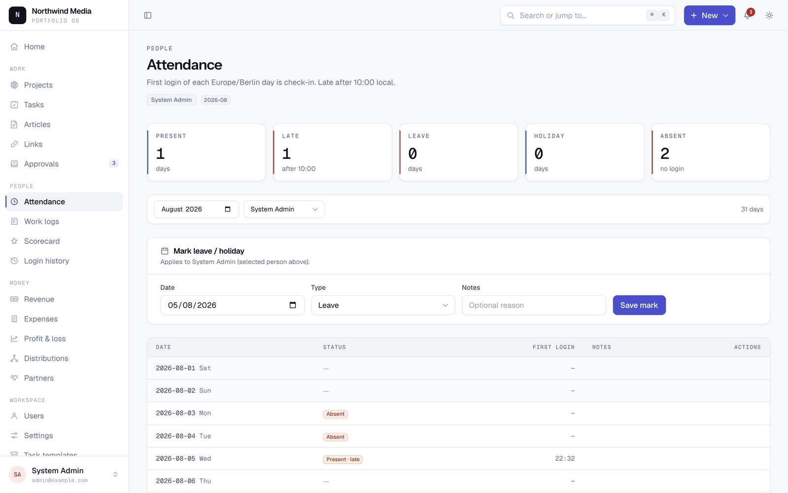 <br> **Attendance** — derived from logins. |

The full navigation on a phone, not a cut-down version:

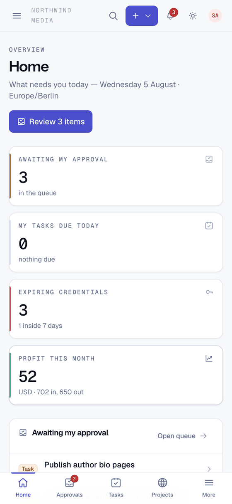

</details>

## Why shared hosting shaped this

The whole app runs on PHP and MySQL: no Node runtime on the server, no Redis, no queue daemon, no websockets, no container. Deployment is two zip files over FTP and a cron entry.

That is a constraint, and it made the app better in ways worth stealing:

- Sessions, cache and queues run on the database or filesystem. Nothing assumes Redis.
- Every queued job is safe to run late, out of order, or twice — a cron drip does all three.
- No reliance on `exec()`, `proc_open()` or `symlink()`. Backups are a pure-PHP SQL export.
- Assets are built locally and uploaded. Fonts are self-hosted WOFF2, so there is no CDN in the runtime path.

Deploy it to a normal VPS and none of this hurts you — you just have headroom you are not using.

## Security posture

- Vault secrets are encrypted at rest with `APP_KEY`. The key *is* the lock: back up your vault before rotating it.
- Decrypted secrets are never stored in component state, so they are not re-sent to the browser on later interactions.
- Money mutations and every credential reveal are written to an audit log.
- Financial records are soft-deleted only. Approved distribution runs are immutable.
- The optional AI assistant is excluded from credentials in code, not by convention, and an LLM never generates SQL that gets executed — questions map onto a fixed whitelist of read-only reports.
- **`/_ops/{action}` is the sharp edge.** It runs migrations and cache commands over HTTP for hosts with no SSH. It 404s when `OPS_TOKEN` is empty or shorter than 32 characters, compares tokens in constant time, is rate-limited per IP, and should be switched off the moment a deploy finishes.
- Two-factor authentication is **scaffold only**: the database columns and a settings toggle exist, but there is no enrolment and no login challenge. Turning the toggle on protects nothing.

Report vulnerabilities privately — see [SECURITY.md](SECURITY.md).

## Stack

PHP 8.3+ · Laravel 13 · Livewire 4 · Alpine.js · Tailwind CSS 4 · Blade · MySQL 8 (SQLite locally) · Vite 8 · Pest 4 · Pint.

No React, no Vue, no Inertia, no SPA.

## Tests

```bash
php artisan test        # 97 tests, SQLite in-memory
vendor/bin/pint --test  # code style
```

CI runs the suite on PHP 8.3, 8.4 and 8.5. Money calculations and approval flows require tests — see [CONTRIBUTING.md](CONTRIBUTING.md).

## Deploying

```bash
./deploy/package.sh    # → deploy/dist/app.zip + public.zip
```

`app.zip` goes to `laravel_app/` outside the web root, `public.zip` to `public_html/`. Migrations run through the token-gated ops route because there is no SSH. Two cron entries handle the scheduler and a `queue:work --stop-when-empty` drip. Full walkthrough: **[DEPLOYMENT.md](DEPLOYMENT.md)**.

## Status and known gaps

All seven planned milestones are done and the app is in production use. See [CHANGELOG.md](CHANGELOG.md).

Honestly:

- **Pick `MONEY_BASE_EXPONENT` before entering data.** Stored integers carry no scale, so changing it later reinterprets every amount. There is no migration for that.
- Column names keep their original `_paisa` / `_pkr_paisa` suffixes. They mean "minor units of the base currency" whatever currency you configure; renaming them would break existing installs for no functional gain.
- Multi-currency is one base plus one optional input currency, not arbitrary per-project currencies.
- Reports are tables. No charting library.
- Wide financial tables scroll sideways on phones rather than reflowing into cards.
- Editing happens in modals and side forms, not inline.

## Docs

| | |
|---|---|
| [docs/INSTALL.md](docs/INSTALL.md) | Local setup, configuration, troubleshooting |
| [docs/USER_GUIDE.md](docs/USER_GUIDE.md) | What each role can do, and the short path to common tasks |
| [DEPLOYMENT.md](DEPLOYMENT.md) | Shared-hosting deploy, ops route, cron, backups |
| [docs/DESIGN_AUDIT.md](docs/DESIGN_AUDIT.md) | The design system and its accepted gaps |
| [CONTRIBUTING.md](CONTRIBUTING.md) | Setup, non-negotiable constraints, PR process |
| [SECURITY.md](SECURITY.md) | Reporting vulnerabilities |
| [CHANGELOG.md](CHANGELOG.md) | Release history |

## Contributing

Welcome. Read [CONTRIBUTING.md](CONTRIBUTING.md) first — it covers the constraints that are not negotiable (shared hosting, integer money, many-to-many roles, immutable approved distributions) and the tests expected for money and approval changes. By participating you agree to the [Code of Conduct](CODE_OF_CONDUCT.md).

## Licence

MIT — see [LICENSE](LICENSE). The bundled fonts (Geist, Geist Mono, Instrument Sans) are third-party software under the SIL Open Font License 1.1 and are not covered by the MIT licence; see [resources/fonts/LICENSE](resources/fonts/LICENSE).
